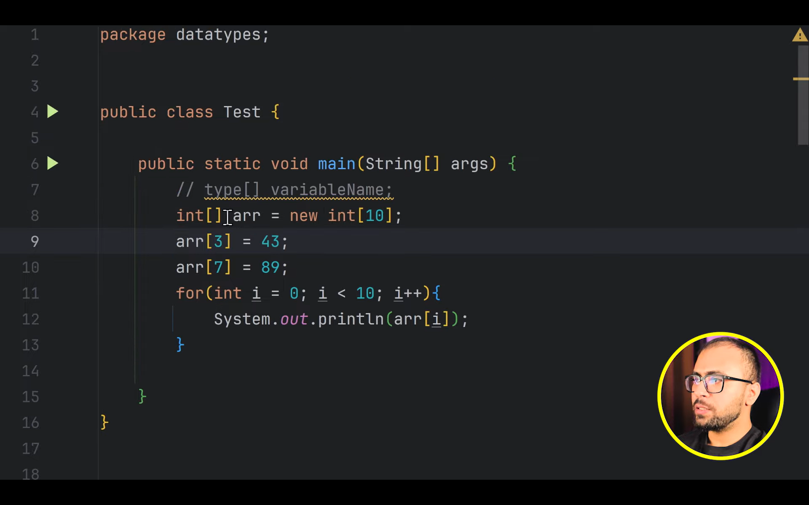
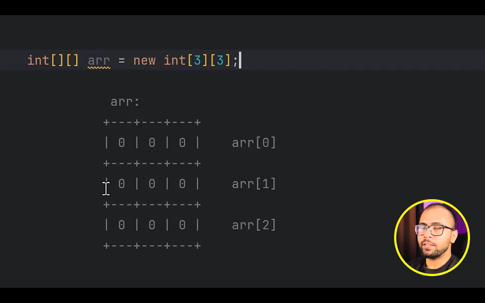
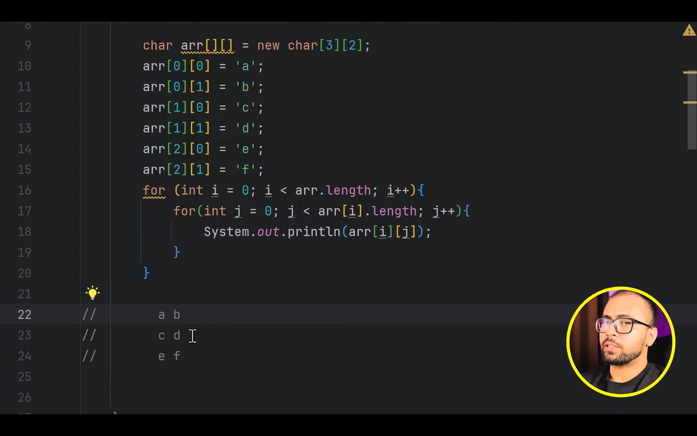

# Arrays in Java
array is nothing but the collection of similar type of data


length of the array can be determined by ``arr.length`` its not a method its a property

```java
int arr[]  = new arr[10];

int arr[] = {1,32,34};
```

## for each loop (used mainly in collections)

```java

for(int i : arr){
//    other code
}

```
taking INT_MIN in hava format


### Creating 2D array


### Jagged array (array of different length arrays) creation and travesal

