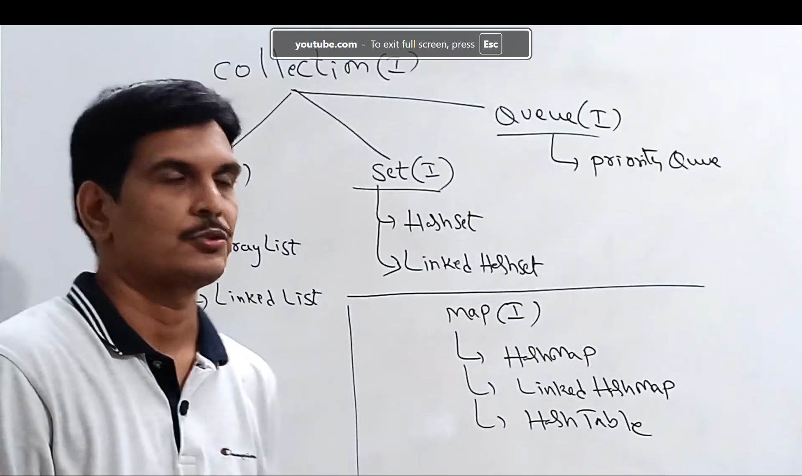
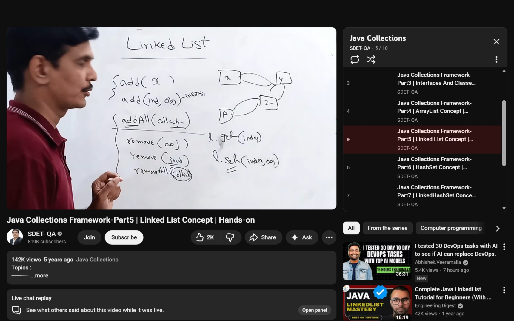
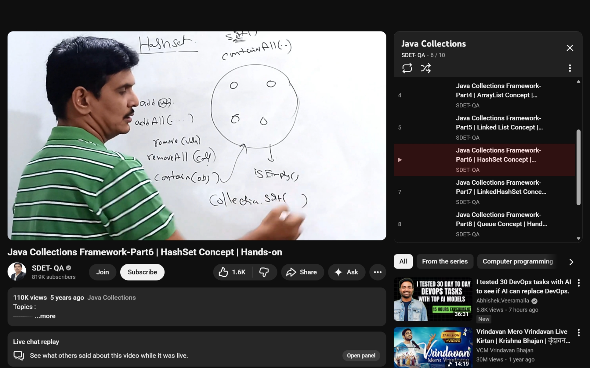

# Collections

Collections is nothing but a group of things

to create this group in have we need certain classes and interfaces which is known as the collection framework


## Why we need the collection framework

to store multiple values within a single variable and then we can access it using that singular entity containing those values

we need array otherwise we would need to declare 100 different variables to store some value, but using collections i can use arrays


### Object Array

```java
Object a = new Object[5];
//here i can store homogenous or heterogeneous data
```
- it is of fixed size
- homogeneous
- it cannot support any ready-made methods


so in collection framework we have things like
1. ArrayList
2. List (Same as ArrayList)
3. Hashmap
4. Hashtable
etc ...
 ## Advantages Of Collections
1. Collections are growable in nature
2. Can store heterogenous data
3. It has a imoplemented underlying data structure so we have ready made for these


# Main Interfaces in the collection interface

## Collection (Interface)
this is the main/root method 
 
collection framework is used to define the set values as single entity and provides the methods which are used by different collection objects.

## Collections (Class) - java.util package

It contains certain set of methods which can be used to perform some operations on ``Collection Objects ``


## Collection Interface (childs) - Main Interfaces
 - List
   - List is the child of collection(i)
   - if i want to preserve the insertion order list is used
   - Duplicates allowed
   - Classes that implements this interface
     - ArrayList
     - LinkedList
     - Vector (extended from stack) -  vector and stack are legacy classes
 - Set
   - Child interface of the collection interface
   - insertion order is not preserved
   - Duplicates are not allowed
   - Set interface is implemented by
     - HashSet
     - LinkedHashset
 - Queue
   - Again the child of the collection interface
   - used when i want to have the elements as first in first out order - **Prior to Processing**.
   - Implemented by
     - priorityQueue


## Other Interface than Collections 
### Map
 - independent to collection framework
 - When we want to represent the elements in the key value pair
 - each key is an object each value is an object
 - Implemented by
   - HashMap
   - Linked Hashmap



## Methods that are available in the collection interface

1. add -  add a new object - add(Object 0)
2. addAll - takes a collection and adds it to the collection - addAll(Collection c)
3. remove(object o)
4. removeAll(Collection c)
5. retainAll(Collection c) - all other objects other than the passed one will be removed
6. clear() - clear all the values in the collection
7. isEmpty()
8. Size() - how many objects are there in the collection
9. contains(object o )
10. containsAll(Collection e)
11. toArray(Collection C) - to conver the collection object to the array object 


## List Methods

1. add(index, Object 0 ) - if you want to add the object in the specific index, other methods will love forward
2. addAll(index, collection c)
3. remove(index)
4. get(index)
5. set(index, object) replace the object with new object


## ArrayList

 - it is present in the java.util package

declaration

```java
import java.util.ArrayList;

ArrayList al = new ArrayList();

//by default the size given initially is 10
```

if we want our arraylist to contain heterogeneous data of some type

```java
import java.util.ArrayList;

ArrayList<String> al = new ArrayList<>();
```
**Available Methods** 

all same from list and the collection object

other methods, from collections class
1. collections.sort(arrayList)
2. collections.shuffle(arrayList)

```java
import java.util.ArrayList;
import java.util.Arrays;
import java.util.Collections;
import java.util.Iterator;

public class arrayListDemo {
    public static void main(String[] args) {
//        declaring the array list
        ArrayList al = new ArrayList();
        ArrayList<Integer> al2 = new ArrayList<Integer>();
        List al3 = new ArrayList();


//        adding new elements
        al.add(100);
        al.add(210);

        System.out.println(al);

//        getting the size of the objects stored in the arraylist
        System.out.println(al.size());

//        removing some elements from arraylist
        al.remove(100); // value/ index anything could be there
        al.remove(1);

//        inserting a new element
        al.add(2); // will insert at the end
        al.add(1, 2); // will insert at index 1


//        retrieving a sepecific value or element or object
        al.get(1); // element at index 1


//        if i want to change some value
        al.set(1, 23); //the value at index 1 is replaced with 23


        System.out.println(al);

//        searching the value in the arraylist

        al.contains(2); // if the value is present in the arrayList or not


//        isEmpty()

        al.isEmpty(); // returns true if the arrayList is empty


//         reading the data from array list
//        using for loop and the get method

//        for each loop
        for (Integer i : al) { // if mixed data i can use Object in place of integer
            System.out.println(i);
        }

//        using Iterator

        System.out.println("reading using Iterator");

        Iterator it = al.iterator();

        while (it.hasNext()) {
            System.out.println(it.next());
        }
//        sorting the elements in the arrayList

        Collections.sort(al);
        System.out.println("After Sorting");
        System.out.println(al);
//        sorting in the reverse order
        System.out.println("Sorting in the reverse Order");
        Collections.sort(al, Collections.reverseOrder());
//      converting array elements to arrayList
        
        int arr[] = {1,2,4,5,6,6,7,7,};
        arrayList al11 = new ArrayList(Arrays.asList(arr));
    }
}
```


## Linked List

Prefer `ArrayList` when you are  more into retrieving the data and don't use it when you have insertion and deletion because it needs to shift the other elements to perform this task (when you want add and remove the elements from the middle).

most of the methods in the linkedList is derived from the list interface but some of the methods are derived from the Dqueue Interface as well and it is preferred to create _**stack and queues**_.


 

### LinkedList specific Methods
1. addFirst() - this methods adds the elements in the beginning of the linkedlist
2. addLast() - elements is added into the last
3. removeFirst() and removeLast()
4. getFirst() and getLast()


````java
public class LinkedList{
    public static void main(String[] args) {
        LinkedList l = new LinkedList();
        
        l.add(100);
        l.add(2);
        l.add("ujjwal");
        l.add("Sharma")
        System.out.println(l);
        
//        there is no default allocation
        l.remove(3) ; // we are just passing the index here 
        
//        add object at the end
        l.addLast(1);
        
//        getting the element by index
        System.out.println(l.get(2));
        
//        change the value
        l.set(1,2);
        
//        to find some value

        System.out.println(l.constains("Ujjwal"));
        
        
//        checking is if empty
        System.out.println(l.isEmpty());
        
//        read the data of the linkedList - same as arraylist
        
//        sorting and adding elements are same as we had it in ArrayList
        
//        for sorting we need to gave the same type of data otherwise it won't work
    }
}
````


# Set
it is the child of the collection interface and it is implemented by two classes `hashset` and `linkedhashset`

## Hashset
used when duplicates are not allowed and insertion order is not preserved it inserts the elements using the concepts of hashcode, there is no concept of index in this

there is no concept of index


when we initialse the hashset the default locations or the size that is initialised is 16

**loadFactor/fillratio** ---> it is nothing but a percentage to which when the structure is filled the new object with the inserted new value is created by default it is `0.75` or `75%`, now in the arrayList when the data structure is filled it creates a new structure with size one more than the previous one copies the older values and then adds the new values to the end 

**can i control how much default value size is initialised and the fill ratio?**

yes using this method

```java
import java.util.HashSet;

HashSet hs  = new HashSet(100) ; // MEMORY LOCATIONS
HashSet hs1 = new HashSet(100,(float) 0.95); // typecase with float

//if we want it to have some homogenous type of the data

Hashtable<Integer> hs2 = new HashSet<Integer>();
```




````java
import java.util.HashSet;
import java.util.Hashtable;

public class hash {
    public static void main(String[] args) {
        HashSet hs = new HashSet();


        hs.add(10);
        hs.add(10);
        hs.add(10);
        hs.add(10);
        hs.add(10);
        System.out.println(hs);// order won't be preserved
        
        
        has.remove(10);// its the value not the index
        
//        get the value
//        get and set methods are not present in this
        
//        contains
        hs.contains(11); //false;
//        we can use for each loop or iterator to read the values in it
        
        for(Object i : hs){
            System.out.println(i);
        }
        
        
        
//        Iterator
        
        Iterator it = hs.iterator();
        while(it.hasNext()){
            System.out.println(hs.next());
        }
        
        
//        union , intersection, Difference
        
//        assume i have created two different hashsets already
        
        
//        union
        set1.addAll(set2); // duplicates will be removed
        
//        intersection
        set1.retainAll(set2); // except set 2 other elements will be retained
        
//        difference of the sets
        set1.removeAll(set2);
        
//        get the subset 
        
        set1.containsAll(set2); // if set2 is the subset of set 1 
        
        
        
        
        
    }
}
````


# LinkedHashSet

basic difference between HashSet and LinkedHashSet 

Insertion order is preserved the duplicates are not allowed

both works on the concept of hashtable but the linkedHashSet uses hastable + LinkedList

```java
import java.util.LinkedHashSet;

public class lHashSet {
    public static void main(String[] args) {
        LinkedHashSet<Integer> ls = new LinkedHashSet<Integer>();
        
        ls.add(10);
        ls.add(10);
        ls.add(10);
        ls.add(10);
        
//        insertion order will be preserved
        
        
    }
}
```


# Queue Concept
Implemented by these interfaces
1. Dequeue
2. BlockingQueue
3. BlockingDqueue 

classes that have implemented this

1. PriorityQueue
2. LinkedList

in both the classes insertion order is preserved, duplicates elements/objects are allowed

**in linkedlist heteregenous data is allowed and i*n queue same type of data is only allowed***


## Methods


1. add - adds to the tail, if add is successful it returns true else returns exception
2. offer - adds to the tail, if successful returns true else returns false
3. element - returns head element, if queue is empty, throws exception
4. peek - returns head element, if queue is empty, returns null
5. remove - return and remove, in case of empty queue returns the exception
6. poll - return and remove, in case of empty queue returns null

```java
import java.util.PriorityQueue;

public class queueDemo {
    public static void main(String[] args) {
        PriorityQueue q = new PriorityQueue();
//        adding elements add, offer
        q.add(1);
        q.offer(2);
        
//        get the element
        q.element();
        q.peek();
        
//        return and remove
        q.remove();
        q.poll();
        
        
//        reading
        Iterator it = q.iterator();
        while(it.hasNext()){
            System.out.println(it.next());
        }
        
//        for each loop
        
        for(Object i :q){
            System.out.println(q);
        }
    }
}
```
# Map
to represent things in the form of key and value pair
 - duplicate keys are not allowed
 - duplicate values are allowed
 - combination of key and value is a entry and map is a collection of entries


## HashMap

1. Internally the underlying data structure is hashtable.
2. Insertion order is not preserved
3. Duplicate keys are not allowed values are allowed
4. Null key is allowed **only once** because key has to be unique, but we can have multiple null values
5. use when we have more number of search operations


### Methods available
1. put - to enter the value into the hashMap, we will pass the key value pair.
2. putAll -  multiple key value pair or map collections into another map
3. get (key) -  to get the value
4. remove(key) - remove the value along with the key
5. contains(key) - to check if it has key or not
6. contains(value) - to check the value if its present or not it returns true or false
7. isEmpty() - to check if is empty or not
8. size() - checks the entries we have
9. clear() - remove all the entries
10. keyset() - returns all the keys from the map - **returns the set since the duplicates are not there**
11. values() - will return all the values - **return type is just a collection**
12. entryset() - returns all the entries as a **set since they are unique in a pair**

### Entry Interface - every entry can be represented by this interface

it is the subset or lower level interface of the HashMap class

**if you want to store the entry in the variable the ype of the variable should be `Map.entry`**

```java
class  HashMap{
    interface Entry{
        
    }
}
```

**Methods in this**
- getKey - returns the key of the entry you have to first extract the entry
- getValue  - returns the value of the already extracted entry
- setValue (Object) - will update/replace the value given in the entry

```java
import java.util.HashSet;
import java.util.Map;

public class HashMap {
    public static void main(String[] args) {
        HashSet m = new HashSet();

        m.put(101, "ujjwal");
        m.put(102, "Sharma");
        m.put(103, "kumar");
        System.out.println(m);

//        what will happen if i enter a duplicate? the old value will be replaced with the new value
        m.get(101); //returns ujjwal

        System.out.println(m.get(101));

//        remove the entry
        m.remove(102); //remove pair from hashmap
        System.out.println(m);

//        if the value present in the hashmap
        System.out.println(containsKey(101));

//        if the value is present
        System.out.println(containsValue("Kumar"));


//        same with other methods too we will try to implement all the methods

        System.out.println(m.keySet()); // returns all the keys
        System.out.println(m.values());// returns all the value


//        ENTRYSET ALL ENTRIES WILL BE RETURNS AS A SET
        System.out.println(m.entrySet());

//        read each key to implement that entry interface


//        once you have defined the datatype as Integer or String, or you can have objects

        for (Object i : m.keySet()) {
            System.out.println(i);
        }


        for (Object i : m.values()) {
            System.out.println(i);
        }


//        lets print the keys and values side by side

        for (Object i : m.keySet()) {
            System.out.println(i + "  " + m.get(i));
        }

//       entry interface specific methods

//        how to capture a single entry
      //  for (Map.Entry entry :m.entrySet()){ // once you have defined it with the specific type of object like Integer or Strings and all
            for(Object i: m.entrySet()){
                System.out.println(i.getKey()); // excute this

        }
            
            
            


    }
}
```


# HashTable
HashMap vs HashTable
Same methods

similarities
1. Data in key value pair
2. Internally follows hashtable and stores the data using hashcode

Differences
1. Hashtable is synchronised - that means, whatever methods are available at a time only one method will access that method. (only one thread allowed a time), hashmap is non-synchronised
2. Hastable is threadsafe HashMap is not
3. Hashmap has faster performance compared to the hashTable
4. hashtable cannot be accepted either as a key or a value, but hashMap can have one null key and multiple null values
5. HashMap(introduced from 1.2 version of java) is new and HashTable is old

```java
import java.util.Hashtable;

class HashTableDemo {
    public static void main(String[] args) {
        Hashtable<Integer, String>  = new Hashtable<Integer, String>();
//        default capacity is 11, loadfactor is 0.75
        
//        if you try to add null it will simply throw NullPointerException
    }
}
```


---


Alright. Let’s **finish this chapter properly** so you never feel confused again.

Below is **the COMPLETE Java Collections picture**, explained **from a C++ mindset**, with **what it is + what operations you can do**.
No jargon. No overthinking.

---

# 🌳 Java Collections — Big Picture


Think of **Collections** as Java’s version of **STL containers**.

They are divided into **4 MAIN TYPES** 👇

---

# 1️⃣ LIST → ordered, duplicates allowed

👉 **C++ equivalent: `vector`, `list`**

## What a List means

* Maintains **order**
* Allows **duplicates**
* Access by **index**

---

## Common List Implementations

### 🔹 `ArrayList`

* Internally uses **array**
* Fast access (`get(i)`)
* Slow insert/delete in middle

**C++ equivalent:** `vector`

### 🔹 `LinkedList`

* Uses **nodes**
* Fast insert/delete
* Slow access

**C++ equivalent:** `list`

---

## Common List Operations (MOST IMPORTANT)

```java
list.add(x);          // push_back
list.add(i, x);       // insert at index
list.get(i);          // v[i]
list.set(i, x);       // update
list.remove(i);       // remove by index
list.remove(x);       // remove by value
list.size();          // size
list.contains(x);     // find
list.clear();         // clear
```

---

# 2️⃣ SET → unique elements only

👉 **C++ equivalent: `set`, `unordered_set`**

## What a Set means

* ❌ No duplicates
* ❌ No index
* Order may or may not exist

---

## Common Set Implementations

### 🔹 `HashSet`

* Fast
* No order

**C++ equivalent:** `unordered_set`

### 🔹 `LinkedHashSet`

* Maintains insertion order

### 🔹 `TreeSet`

* Sorted order

**C++ equivalent:** `set`

---

## Common Set Operations

```java
set.add(x);
set.remove(x);
set.contains(x);
set.size();
set.clear();
```

❌ No `get(index)` (important!)

---

# 3️⃣ MAP → key-value pairs

👉 **C++ equivalent: `map`, `unordered_map`**

## What a Map means

* Data stored as **key → value**
* Keys are **unique**
* Values can repeat

---

## Common Map Implementations

### 🔹 `HashMap`

* Fast
* No order

**C++ equivalent:** `unordered_map`

### 🔹 `LinkedHashMap`

* Insertion order

### 🔹 `TreeMap`

* Sorted by key

**C++ equivalent:** `map`

---

## Common Map Operations

```java
map.put(key, value);       // insert
map.get(key);              // access
map.remove(key);           // delete
map.containsKey(key);
map.containsValue(value);
map.size();
map.clear();
```

---

# 4️⃣ QUEUE / DEQUE → FIFO / Double-ended

👉 **C++ equivalent: `queue`, `deque`**

## What a Queue means

* FIFO (First In First Out)

---

## Common Queue Implementations

### 🔹 `Queue` (interface)

### 🔹 `ArrayDeque`

* Fast
* Used as stack or queue

---

## Common Queue Operations

```java
queue.add(x);       // enqueue
queue.poll();       // dequeue
queue.peek();       // front element
queue.isEmpty();
```

---

# 🧠 Stack (Special Case)

Java **does have `Stack`**, but it’s considered old.

### Preferred way:

```java
Deque<Integer> stack = new ArrayDeque<>();
stack.push(x);
stack.pop();
stack.peek();
```

**C++ equivalent:** `stack`

---

# 🔁 Iterator (How to loop)

```java
for (int x : list) { }
for (int x : set)  { }
for (var e : map.entrySet()) { }
```

Same idea as range-based `for` in C++.

---

# 📌 VERY IMPORTANT RULES (burn these in memory)

1. **List → ordered, duplicates**
2. **Set → unique**
3. **Map → key-value**
4. **Right side creates object**
5. **Left side controls access**
6. **Use interfaces (`List`, `Set`, `Map`) on left**

---

# 🔥 Ultimate C++ → Java Mapping

| C++           | Java       |
| ------------- | ---------- |
| vector        | ArrayList  |
| list          | LinkedList |
| set           | TreeSet    |
| unordered_set | HashSet    |
| map           | TreeMap    |
| unordered_map | HashMap    |
| queue         | Queue      |
| deque         | ArrayDeque |

---

# 🎯 What YOU should use as a beginner

```java
List<Integer> list = new ArrayList<>();
Set<Integer> set = new HashSet<>();
Map<Integer, Integer> map = new HashMap<>();
Queue<Integer> q = new ArrayDeque<>();
```

Memorize this. You’re DONE.

---

If you want next:

* Internals of **ArrayList resizing**
* Time complexity comparison (placement POV)
* Java collections **exam-ready explanation**
* Convert **STL-heavy C++ code to Java**

Just say the word 👊
