# Multithreading

CPU  - logical processing unit of the computer
Core - individual processing unit in the CPU
Program - Set of instructions written in a programming language that tells the computer how to perform specific task
Process - A process is an instance of a programs that is being executed, when a program runs, the operating system creates a process to manage its execution
Thread - Smallest Unit of execution within a process. a process can have multiple threads which share the same resources but can run independently

multiple threads for different tabs, in MS Word, different tabs for each functionality like spell check, mouse cursor and all


## Multitasking
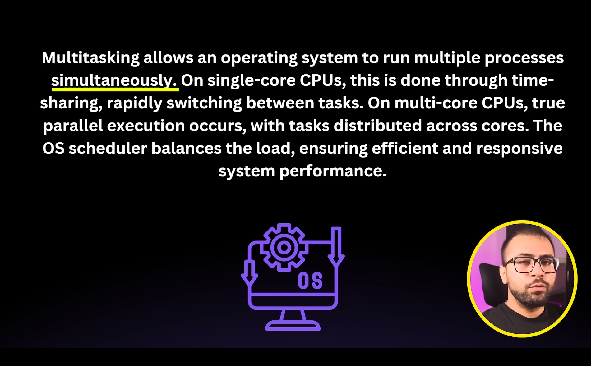


# Multi-Threading
Multithreading refers to the ability to execute multiple threads within a single process concurrently


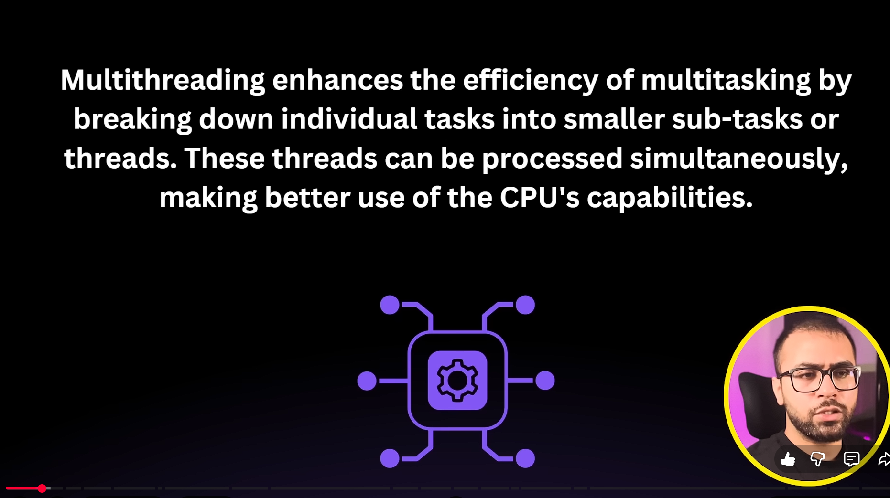

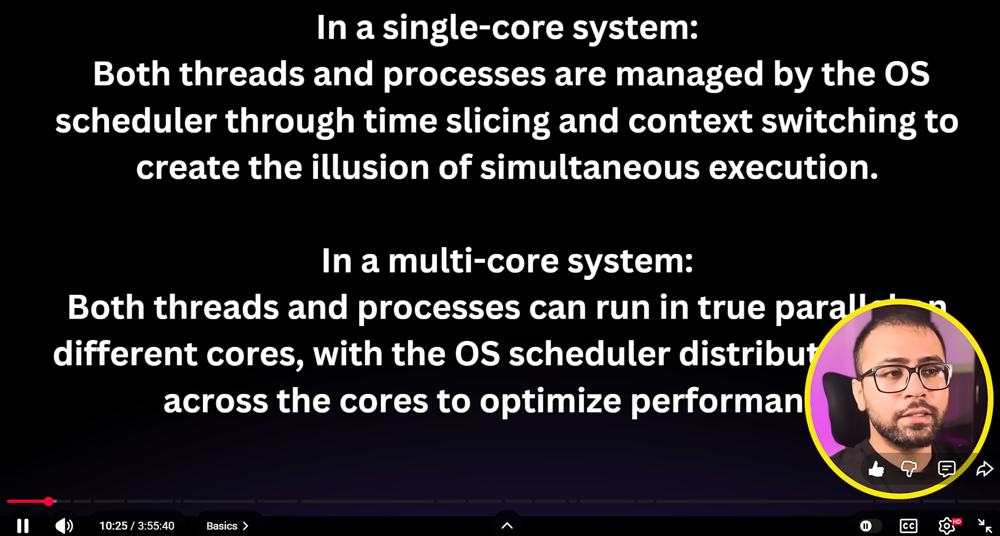

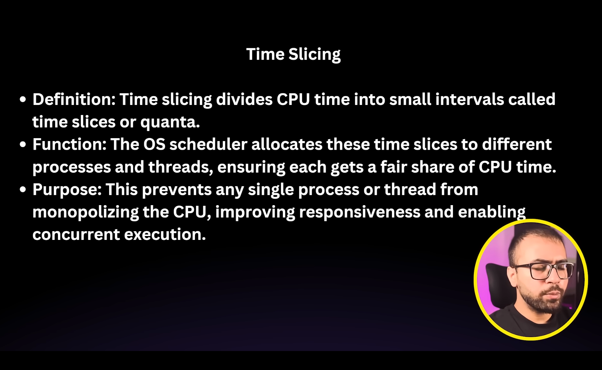

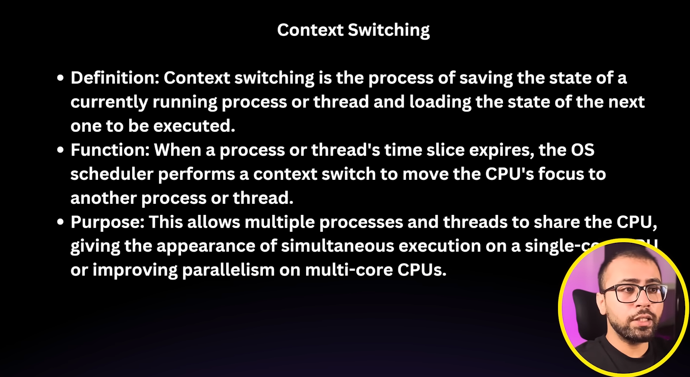

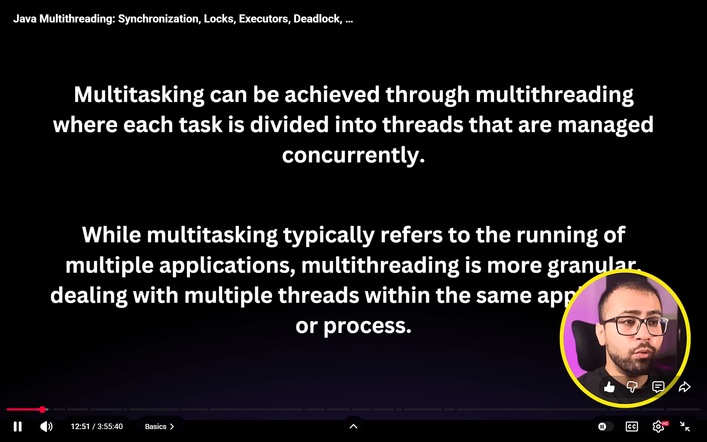

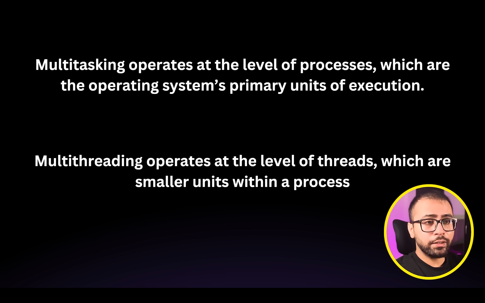

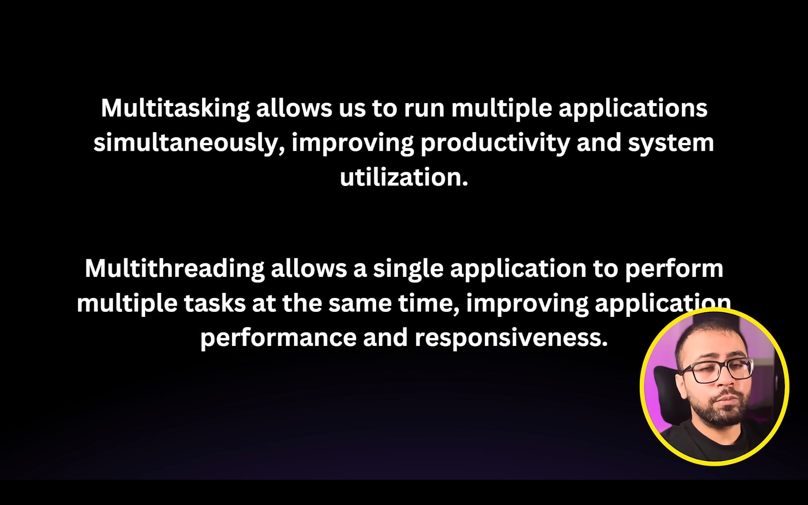

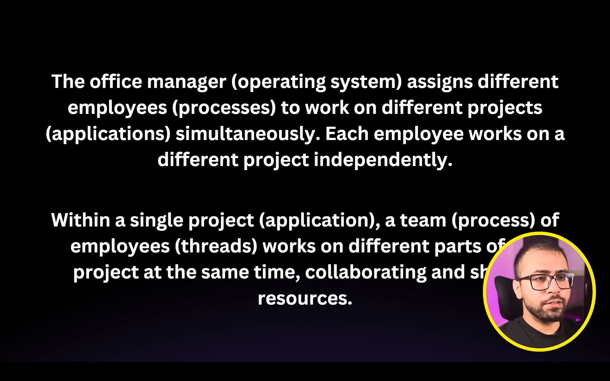

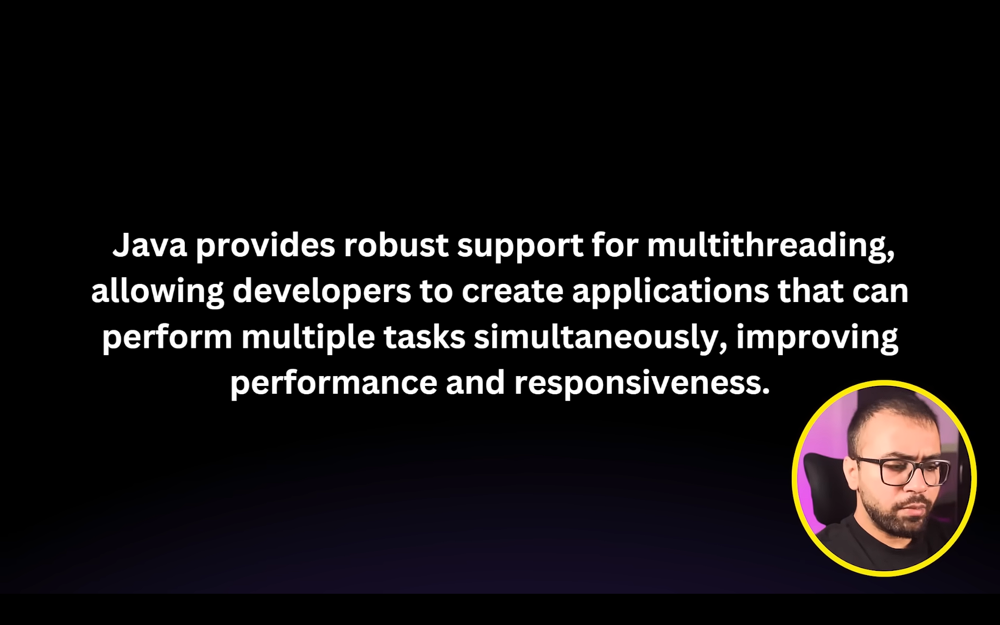


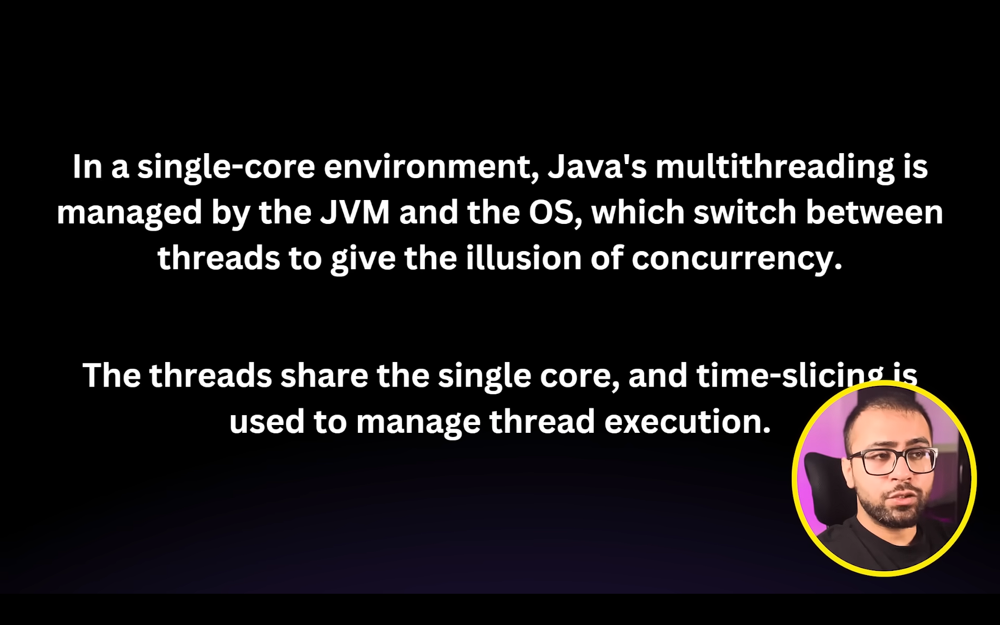


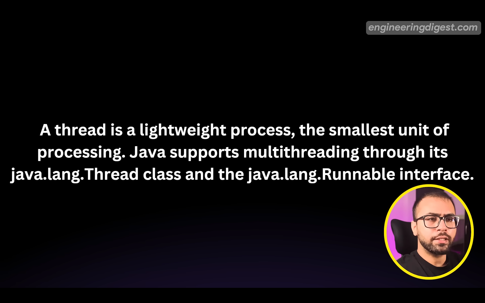

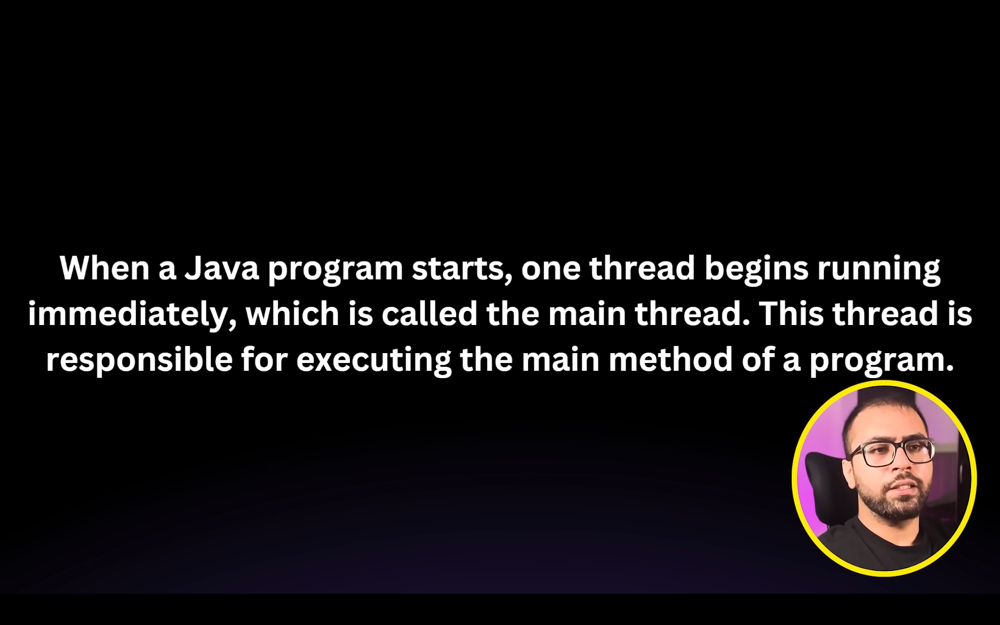

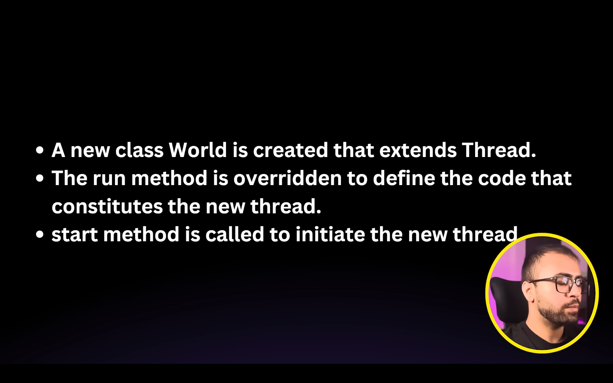


## How to Implement MultiThreading
```java

class Main{
    public static void main(String[] args) {
        
        threadExample obj = new threadExample();
        obj.start(); // it will run the method
        System.out.println(Thread.currentThread().getName());
    }
}
```

```java

//the task i wanna perform in the other thread needs to be there in other class as well
class threadExample extends Thread{
    @Override
    public void run(){
        System.out.println(Thread.currentThread().getName());
    }
}
```


## Using Runnable Interface


```java
class Main{
    public static void main(String[] args) {
        
        runnableExample obj = new Runnable();
        Thread t1 = new Thread(obj); // new state of the thread 
        t1.start(); // runnable state
        System.out.println(Thread.currentThread().getName());
    }
}
```

```java
class runnableExample implements Runnable{
    @Override
    public void run(){
        System.out.println(Thread.currentThread().getName());
    }
}
```
# Thread Lifecycle
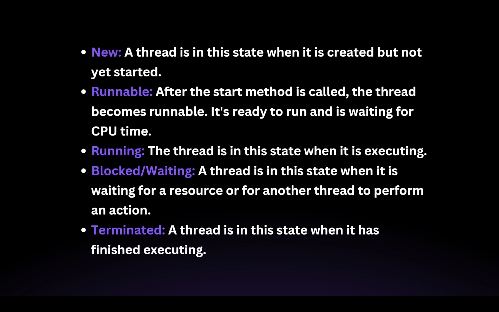

in the internal states of java a running state is not there the runnable state itself is considered either the method is running or ready to rum the enum implementation of state doesn't contain anything anything known as running


so it will never show  `RUNNING` state.

```java


class thread extends Thread{
    @Override
    public void run(){
        System.out.println("Running");
        try{
            Thread.sleep(4000);
        }catch (InterruptedException e){
            System.out.println(e);
        }
    }
}
class Main{
    public static void main(String[] args) throws InterruptedException{
        thread t1 = new thread();
        System.out.println(t1.getState());
        
        t1.start();
        System.out.println(Thread.currentThread().getState());
        
        Thread.sleep(10000);

        System.out.println(Thread.currentThread().getState()); // TIMED-WAITING
        t1.join(); //main method will wait for t1 to complete  --> jiske upr join kiya jaata h that one waits for it

        System.out.println("Finished the execution part of it as well"); //TERMINATED STATE
        
    }
}
```


## Thread Vs Runnable

when a class has already extended some other class, so in that case we will use runnable.


# Thread Methods
- start -> runs the `run` method automatically
- run -> works like the main method of the thread
- Thread.sleep - to make the thread sleep for sometimes **has to be compulsorily handled in the try catch block**
- t.join() - jis method par call krte h it waits for the other thread running to complete and goes into `TIMED WAITING` state.
- t.setPriority(VALUE) - max 10, min 1 , norm 5, MIN_PRIORITY, MAX_PRIORITY, NORM_PRIORITY -  these are not strict rules just the hints that we are giving to processor and JVM `more noticeable in single core processor
- t.interrupt() -> whatever the processor is doing just interrupt it, even sleeping or something
- Thread.yeild() -> this is used within the processor just tells the jvm that you can give the chance to another processors as well my pausing my execution, this is just the hint that JVM might choose to ignore.
- Daemon Threads - the ones that runs in the background, user threads which we generally use, jvm doesnt wait for it to terminate it will get terminated once the user threads are done with their execution

```java
public void main(String[] args) {
    thread t   = new thread();
    
    thread.setDaemon(true);
    thread.start();
    System.out.println("Main Done");
    
//    execution of the other thread will be stopped once the main is done it doesn't wait for the daemon thread to complete the execition before it stops
}
```


### How can i give name to a thread?

just create the constructor of the class that is extending the `Thread` Class and call the super constructor and pass the name in it

```java
class t extends Thread{
    t(String name){
        super(name);
    }
}
```


# Synchronisation

example of counter getting incremented the same object is shared among multiple threads and use of syncronised keyword in the counter increment method and use of synchronoised block
```java
synchronized (this){
    // this is knon as synchronised block
        }
```
mutual exclusion - when one thread only can access the critical resource at a particular point of time

# Locks

when a thread enters into the critical section of the it gets the access of the lock so the other threads cannot interfere when it is executing something on the critical resource once its done it gives the lock access to other waiting threads to complete their operation on critical resource


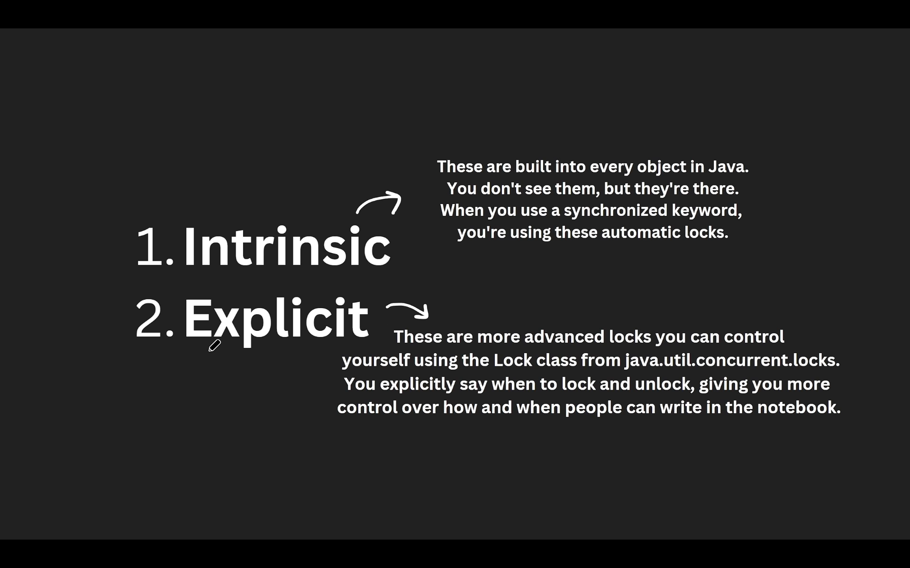

1. Intrinsic  - majorly used when we use the synchronised keyword with different objects
2. Explicit - these are the more advance locks that we ourselves control


 


