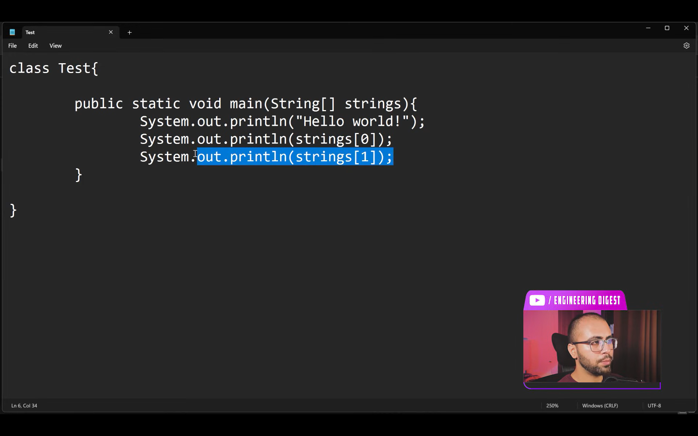
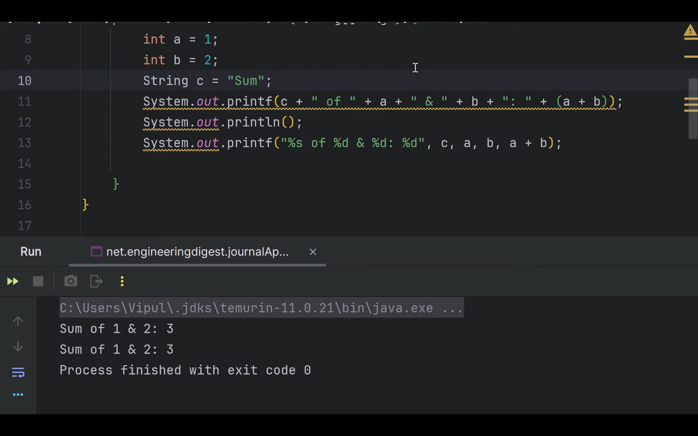
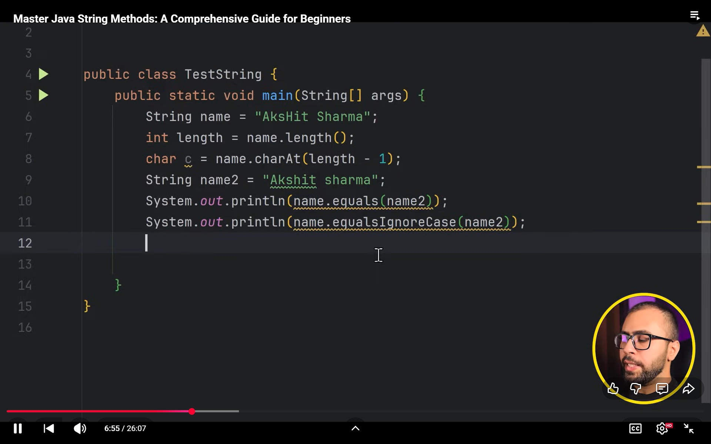
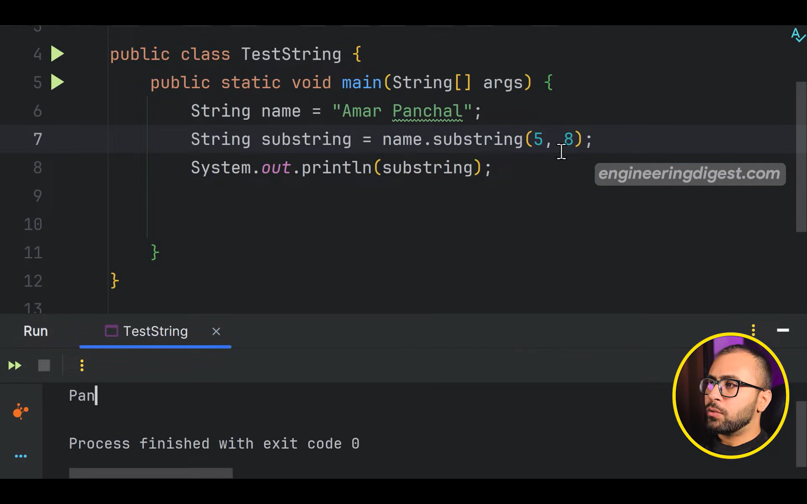
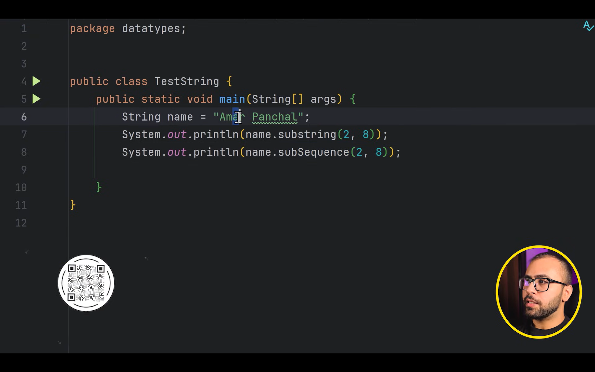

# JVM JRE and JDK
how JVM handles the code line by line?
when the code is given to JVM it works in two passes
1. entire code is parsed and instructions are grouped
2. the code is executed line by line
so the entire flow goes like


Java File ---> Compiler ---> Java.class file ---> JVM ---> Final Output


there is a compiler in the JVM too which pre-compute/compile the frequently used code (This is known as Just In Time Compiler (JIT))


# Understanding the Skeleton of the Java Program


### Command Line Arguments



# Println vs Print vs Printf in Java

```java

class Main{
    static void main(String[] args){
        System.out.println("Hello World!");
    }
}


//system is class that contains system related utility method that means the 
//method that interacts with the system runtime

//out is the static member of system class to print anything on the console
```

 - println -> prints the intended things to the console and inserts the new line character at the end
 - print -> just prints the intented operation on the console
 - printf -> other two methods have single arguments and printf has multiple arguments which can be passed without string concatenation we can use the format specifiers like
    `&s` for string,  `%d` for integer, `%f` for float and `%c`for char and by default in float after point you will get 6 digits
 - 


if you want only 2 digits after decimal


## locale in printf!


it just changed the format of things like date, numbers etc


# Strings in Java
strings are nothing but the sequence of characters, its not primitive, its a class  

since string is a object it can be created in following two ways


there are total 2 ways to allocate strings 


```java

class Main{
    static void main(String[] args) {
//        way 1
        String s = "Ujjwal";
//        way 2
        String st = new String("Ujjwal");
        
    }
}
```

### What is the difference between both

when you use the `new` keyword to create it the new space is allocated irrespective of anything  

when you use the `literal` method if you give the value of the string same as the previous once the new space is not wasted just the new reference variable pointing to same value in the `String pool Space`

String Pool -> it is nothing but the part of the heap where string literals are stored and ref variables are pointed to the same location if they are of same value to save the space

the `new method` creates the string everytime the in the heap

so now if we use `==` operator ---> this compares the equality of the references not the actual value of the string
and `equals` method compare the value

when we apply the `==` in string literal stored in string pool pointing to the same ref you will get true but in case of `new` method it is always false because everytime you explicitly allot a new space in the heap memory


# String Methods

___when we press `alt + Enter` into any method intelliJ creates a new variable for the output of the respective method we are using___



last mentioned element is ignored in this substring method


- trim() --> to remove the spaces extra whitespaces and the start and end
- toUpperCase() -->  conversion to uppercase
- replace("already present" "new string")
- contains ("koi substr ya char exist krta h ya nahi")
- startsWith()
- isBlank
- indexOf
- lastIndexOf
sab methods se nayi string aari h, kyuki string immutable aari h, string asliyat m immutable h  
immutable isiliye hoti h kyuki aap socke baithe ho ki vo change nahi hogi, vrna agr string pool m ek jagah change hui toh it will propagate to all occurances

### String.Format


Subsequence
