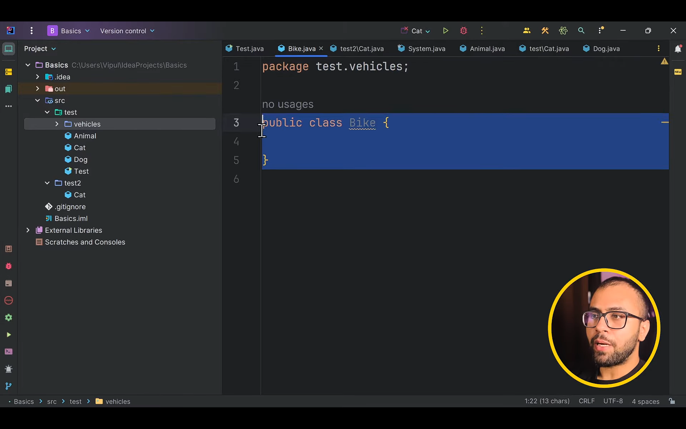

# Packages
> its just like folders, that contains classes to organize them  
we cannot create the same class twice in a package this helps us differentiate the class

### Accessing the class present in the other package


### Subpackage



### What is Classpath?

* **Classpath** tells the **JVM where to find `.class` files and JARs**.
* It is a **list of directories or JAR files**.

> JVM searches classes **only inside the classpath**.

---

### Why Classpath is needed

When Java sees:

```java
import com.mycompany.utils.MathUtils;
```

JVM looks for:

```
com/mycompany/utils/MathUtils.class
```

**inside the classpath locations**.

If not found → `ClassNotFoundException`.

---

### Package + Classpath relation

```java
package com.mycompany.utils;
```

Folder structure:

```
com/
 └── mycompany/
     └── utils/
         └── MathUtils.class
```

✅ **Classpath should point to the root folder**, not `com`.

```
classpath = /project/bin
```

---

### Important rule (remember this)

> **Classpath always points to the root of the package structure.**

---


### One-line exam definition

> **Classpath is the location where JVM searches for required classes and packages.**

### Multiple classes in the same Package
class apart from the public classes becomes package private