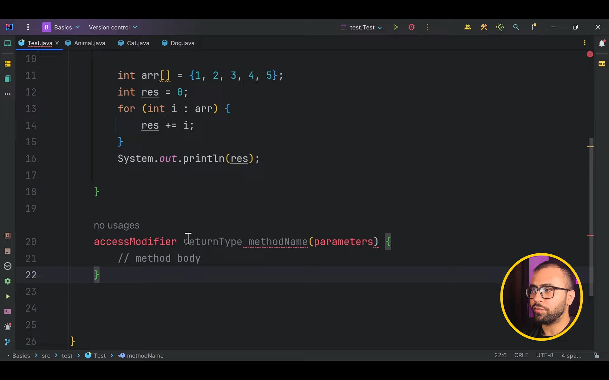
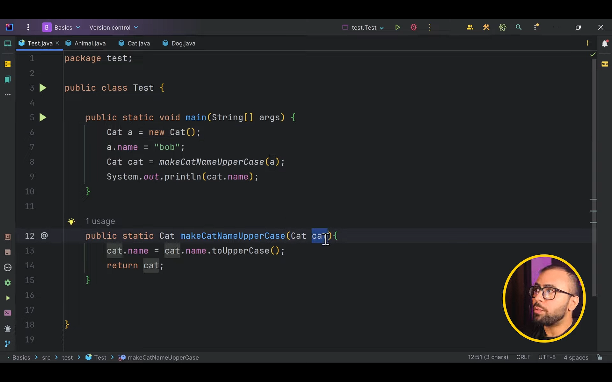

# Method

### Syntax of a method

### When do we use it?

it is used to group the single functionality into a piece of code which can be used at multiple places as per the requirements, so when you need to make the changes you can do it at once place

### Method Overloading

Yaani ke method ka naam return type and everything else is same but the number of parameters is different

signature **doesn't include** the return type and the access modifiers it includes only the name and the arguments - be it type, sequence, or the number of arguments

**so changing the name or the arguments -  both changes the signature**

here the actual value changes not since we have passed the reference of the memory location of the cat where the name value has been stored

**so passing of primitive datatype is different than that of non-primitive datatype**

### Variable Args

when passed we can treat that as an array so we don't need to explictly create the array object